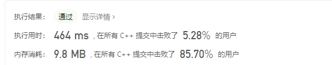

# 1、两数之和

给定一个整数数组nums和一个整数目标值target，请你在该数组中找出和为目标值target的那两个整数，并返回它们的数组下标。

你可以假设每种输入只会对应一个答案。但是数组中同一个元素的答案里不能重复出现。

你可以按任意顺序返回答案。

示例1：

```
输入： nums = [2,7,11,15],target = 9
输出： [0,1]
解释： 因为 nums[0] + nums[1] == 9 ,返回[0,1]
```

示例2：


```
输入： nums = [3,2,4], target = 6
输出： [1,2]
```

示例3：


```
输入：nums = [3,3], target = 6
输出：[0,1]
```

提示：

- 2 <= nums.length <= 10^4
- -10^9 <= nums[i] <= 10^9
- -10^9 <= target <= 10^9
- 只会存在一个有效答案


# 我的代码


```
class Solution {
public:
    vector<int> twoSum(vector<int>& nums, int target) {
        vector<int> result;
        for(int i = 0;i<nums.size()-1;i++)
        {
            for(int j = i+1;j<nums.size();j++)
            {
                if(nums[i]+nums[j] == target)
                {
                    result.push_back(i);
                    result.push_back(j);
                }
            }
        }
        return result;
    }
};
```

代码执行结果：


执行用时和内存消耗情况：



我的算法的时间按复杂度为O(n^2),所以执行用时较长。仅仅击败5.28%的用户。去学习一下大神的算法。

### 复杂度分析

- 时间复杂度：O(N^2)，其中 N 是数组中的元素数量。最坏情况下数组中任意两个数都要被匹配一次。
- 空间复杂度：O(1)。


# 哈希表

使用哈希表，可以将寻找target - x的时间复杂度从O(N)降低到O(1)。

创建一个哈希表，对于每一个x，首先查询哈希表中是否存在target - x，然后将x插入到哈希表中，即可保证不会让x和自己匹配。

```
class Solution {
public:
    vector<int> twoSum(vector<int>& nums, int target) {
        unordered_map<int,int> hashtable;
        for(int i = 0;i<nums.size();i++)
        {
            auto it = hashtable.find(target - nums[i]);
            if(it!=hashtable.end())
            {
                return {it->second,i};
            }
            hashtable[nums[i]] = i;
        }
        return {};
    }
};
```

代码执行结果：


执行用时和内存消耗情况：


### 复杂度分析

- 时间复杂度：O(N)，其中N是数组中的元素数量。对于每一个元素x，我们可以O(1)地寻找target - x。
- 空间复杂度：O(N),其中N是数组中的元素数量。主要为哈希表的开销。
