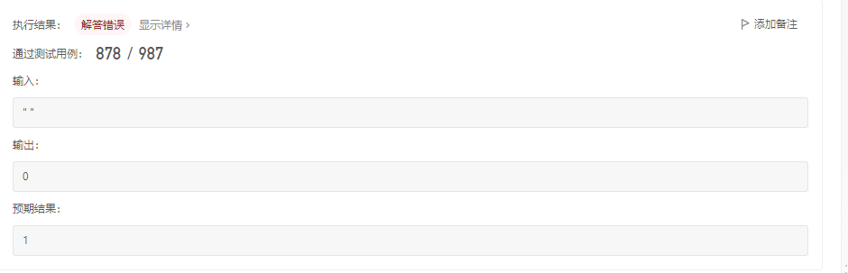

# 无重复字符的最长字串

给定一个字符串s，请你找出其中不含有重复字符的最长子串的长度。

示例1：

```
输入： s = "abcabcbb"
输出： 3
解释：因为无重复字符的最长子串是“abc”，所以其长度为3。
```

示例2：

```
输入： s = "bbbbbb"
输出： 1
解释： 因为无重复字符的最长子串是"b"，所以其长度为1。
```

示例3：

```
输入： s = "pwwkew"
输出： 3
解释：因为无重复字符的最长子串是"wke"，所以其长度为3。
     请注意，你的答案必须是子串的长度，"pwke"是一个子序列，不是子串。
```

提示：

- 0 <= s.length <= 5*10^4
- s是由英文字母、数字、符号和空格组成

# 我的算法

```
class Solution {
public:
    int lengthOfLongestSubstring(string s) {
        string subString;
        int maxLength=0;
        for(int i = 0;i<s.size();i++)
        {
            char s1 = s[i];
            subString = "";
            subString +=s1;
            for(int j=i+1;j<s.size();j++)
            {
                char s2 = s[j];
                if (subString.find(s2) == string::npos )
                {
                    subString+=s2;
                }
                else
                {
                    if(maxLength<subString.size())
                    {
                        maxLength = subString.size();
                    }
                    subString = "";
                    subString += s2;
                }
            }
        }
        return maxLength;
    }
};
```

代码执行结果：


执行结果：



最终结果是，解答错误。.....

# 方法一：滑动窗口

思路和算法

用一个例子考虑如何在较优的时间复杂度内通过本题。

以示例一中的字符串abcabcbb为例，找出从每一个字符开始的，不包含重复字符的最长子串。那么其中最长的那个字符串即为答案。对于示例一中的字符串，列举出这些结果，其中括号中表示选中的字符以及最长的字符串：

- 以（a）bcabcbb开始的最长字符串为（abc）abcbb；
- 以a（b）cabcbb开始的最长字符串为a（bca）bcbb；
- 以ab（c）abcbb开始的最长字符串为ab（cab）cbb；
- 以abc（a）bcbb开始的最长字符串为abc（abc）bb；
- 以abca（b）cbb开始的最长字符串为abca（bc）bb；
- 以abcab（c）bb开始的最长字符串为abcab（cb）b；
- 以abcabc（b）b开始的最长字符串为abcabc（b）b；
- 以abcabcb（b）开始的最长字符串为abcabcb（b）；

依次递增地枚举子串的起始位置，那么子串的结束位置也是递增的！这里的原因在于，假设我们选择字符串中的第k个字符作为起始位置，并且得到了不包含重复字符的最长子串的结束位置为rk。那么当我们选择第k+1个字符作为起始位置时，首先从k+1到rk的字符显然是不重复的，并且由于少了原本的第k个字符，可以尝试继续增大rk，直到右侧出现了重复字符为止。

这样一来，就可以使用"滑动窗口"来解决这个问题：

- 使用两个指针表示字符串中的某个子串（或窗口）的左右边界，其中左指针代表着上文中“枚举子串的起始位置”，而右指针即为上文中的rk；
- 在每一步的操作中，会将左指针向右移动一格，表示我们开始枚举下一个字符串作为起始位置，然后我们可以不断地向右移动右指针，但需要保证这两个指针对应的子串中没有重复的字符。在移动结束后，这个子串就对应着以左指针开始的，不包含重复字符的最长子串。记录下这个子串的长度；
- 在枚举结束后，找到的最长的子串的长度即为答案。

### 判断重复字符

在上面的流程中，需要使用一种数据结构来判断是否有重复的字符，常用的数据结构为哈希集合（即C++中的std::unordered_set，Java中的HashSet，Python中的set，Javascript中的Set）。在左指针向右移动的时候，从哈希集合中移除一个字符，在右指针向右移动的时候，往哈希集合中添加一个字符。


```
class Solution {
public:
    int lengthOfLongestSubstring(string s) {
        // 哈希集合，记录每个字符是否出现过
        unordered_set<char> occ;
        int n = s.size();
        // 右指针，初始值为 -1，相当于我们在字符串的左边界的左侧，还没有开始移动
        int rk = -1, ans = 0;
        // 枚举左指针的位置，初始值隐性地表示为 -1
        for (int i = 0; i < n; ++i) {
            if (i != 0) {
                // 左指针向右移动一格，移除一个字符
                occ.erase(s[i - 1]);
            }
            while (rk + 1 < n && !occ.count(s[rk + 1])) {
                // 不断地移动右指针
                occ.insert(s[rk + 1]);
                ++rk;
            }
            // 第 i 到 rk 个字符是一个极长的无重复字符子串
            ans = max(ans, rk - i + 1);
        }
        return ans;
    }
};
```

代码执行结果：


执行结果：


### 复杂度分析

- 时间复杂度：O(N)，其中N是字符串的长度。左指针和右指针分别会遍历主泵个字符串一次。
- 空间复杂度：O(∣Σ∣)，其中Σ表示字符集（即字符串中可以出现的字符），∣Σ∣表示字符集的大小。
