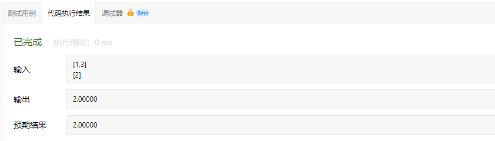
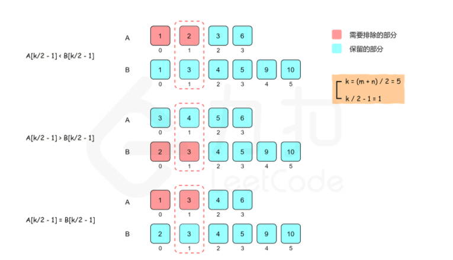

# 寻找两个正序数组的中位数

给定两个大小分别为m和n的正序（从小到大）数组nums1和nums2，请你找出并返回这两个正序数组的中位数。算法的时间复杂度应该为O(log(m+n))。

示例1：

```
输入： nums1 = [1,3],  nums2 = [2]
输出： 2.00000
解释：合并数组 = [1,2,3]，中位数 2
```

示例2：

```
输入： nums1 = [1,2], nums2 = [3,4]
输出： 2.50000
解释： 合并数组 = [1,2,3,4]，中位数（2+3）/2 = 2.5
```

提示：
- nums1.length == m
- nums2.length == n
- 0 <= m <= 1000
- 0 <= n <= 1000
- 1 <= m+n <= 2000
- -10^6 <= nums1[i], nums2[i] <= 10^6


# 我的代码

```
class Solution {
public:
    double findMedianSortedArrays(vector<int>& nums1, vector<int>& nums2) {
        double num;
        for(vector<int>::iterator it = nums2.begin();it<nums2.end();it++)
            nums1.push_back(*it);

        sort(nums1.begin(),nums1.end());

        if(nums1.size() % 2 == 0)
            num = (nums1[nums1.size()/2-1] + nums1[nums1.size()/2])/2.0 ;
        else
            num = nums1[(nums1.size()-1)/2];

        return num;
    }
};
```

代码执行结果：



执行结果：


# 二分查找
给定两个有序数组，要求找到两个有序数组的中位数，最直观的思路有以下两种：

- 使用归并的方式，合并两个有序数组，得到一个大的有序数组。大的有序数组的中间位置的元素即为中位数。
- 不需要合并两个有序数组，只要找到中位数的位置即可。由于两个数组的长度已知，因此中位数对应的两个数组的下标之和也是已知的。维护两个指针，初始时分别指向两个数组的下标0的位置，每次将指向较小值的指针后移一位（如果一个指针已经到达数组末尾，则只需要移动另一个数组的指针），直到到达中位数的位置。

假设两个有序数组的长度分别为m和n，上述两种思路的复杂度如何？

第一种思路的时间复杂度是O(m+n)，空间复杂度是O(m+n)。第二种思路虽然可以将空间复杂度降到O(1)，但是时间复杂度仍是O(m+n)。

如何把时间复杂度降低到O(log(m+n))呢？如果对时间复杂度的要求有log，通常都需要用到二分查找，这道题也可以通过二分查找实现。

根据中位数的定义，当m+n是奇数时，中位数是两个有序数组中的第(m+n)/2个元素，当m+n是偶数时，中位数时两个有序数组中的第(m+n)/2个元素和第(m+n)/2+1个元素的平均值。因此，这道题可以转化成寻找两个有序数组中的第k小的数，其中k为（m+n）/2或（m+n）/2+1。

假设两个有序数组分别为A和B。要找到第k个元素，我们可以比较A[k/2-1]和B[k/2-1]，其中/表示整数除法。由于A[k/2-1]和B[k/2-1]的前面分别有A[0..k/2-2]和B[0..k/2-2]，即k/2-1个元素，对于A[k/2-1]和B[k/2-1]中较小值，最多只会有（k/2-1）+(k/2-1)<=k-2个元素比它小，那么它就不能是第k小的数了。

可以归纳出三种情况：

- 如果A[k/2-1]<B[k/2-1]，则比A[k/2-1]小的数最多只有A的前k/2-1个数和B的前k/2-1个数，即比A[k/2-1]小的数最多只有k-2个，因此A[k/2-1]不可能是第k个数,A[0]到A[k/2-1]也都不可能是第k个数，可以全部排除。
- 如果A[k/2-1]>B[k/2-1]，则可以排除B[0]到B[k/2-1]。
- 如果A[k/2-1]=B[k/2-1]，则可以归入第一种情况处理。



比较A[k/2-1]和B[k/2-1]之后，可以排除k/2个不可能是第k小的数，查找范围缩小了一半。同时，将在排除后的新数组上继续进行二分查找，并且根据排除的个数，减少k的值，这是因为排除的数都不大于第k小的数。

有以下三种情况需要特殊处理：

- 如果A[k/2-1]或者B[k/2-1]越界，可以选取对应数组中的最后一个元素。在这种情况下，必须根据排除数的个数减少k的值，而不能直接将k减去k/2。
- 如果一个数组为空，说明该数组中的所有元素都被排除，可以直接返回另一个数组中第k小的元素。
- 如果k=1，只要返回两个数组首元素的最小值即可。

用一个例子说明上述算法。假设有两个有序数组如下：

```
A : 1  3  4  9
B : 1  2  3  4  5  6  7  8  9
```

两个有序数组的长度分别是4和9，长度之和是13，中位数是两个有序数组中的第7个元素，因此需要找到第k = 7个元素。

比较两个有序数组中下标为k/2-1 = 2的数，即A[2]和B[2]，如下面所示：

```
A : 1  3  4  9
          ↑
B : 1  2  3  4  5  6  7  8  9
          ↑
```

由于A[2]>B[2]，因此排除B[0]到B[2]，即数组B的下标偏移变为3，同时更新k的值：k= k-k/2 = 4。

下一步寻找，比较两个有序数组中下标为k/2-1=1的个数，即比较A[1]和B[4]，如下面所示，其中方括号部分表示已经被移除的数。

```
A : 1  3  4  9
       ↑
B : [1  2  3 ] 4  5  6  7  8  9
                  ↑
```

由于A[1]<B[4]，因此排除A[0]到A[1]，即数组A的下标偏移变为2，同时更新k的值：k=k-k/2=2。

下一步寻找，比较两个有序数组中下标为k/2-1=0的数，即比较A[2]和B[3]，如下面所示，其中方括号部分表示已经被排除的数。

```
A : [1  3]  4  9
            ↑
B : [1  2  3 ] 4  5  6  7  8  9
               ↑
```

由于A[2]=B[3]，根据之前的规则，排除A中的元素，因此排除A[2]，即数组A的下标偏移变为3，同时更新k的值：k=k-k/2=1。

由于k的值变成1，因此比较两个有序数组中的未排除下标范围内的第一个数，其中较小的数即为第k个数，由于A[3]>B[3]，因此第k个数是B[3] = 4。

```
A : [1  3  4]  9
               ↑
B : [1  2  3 ] 4  5  6  7  8  9
               ↑
```

代码实现如下：

  ```
  class Solution {
  public:
      int getKthElement(const vector<int>& nums1, const vector<int>& nums2, int k) {
          /* 主要思路：要找到第 k (k>1) 小的元素，那么就取 pivot1 = nums1[k/2-1] 和 pivot2 = nums2[k/2-1] 进行比较
           * 这里的 "/" 表示整除
           * nums1 中小于等于 pivot1 的元素有 nums1[0 .. k/2-2] 共计 k/2-1 个
           * nums2 中小于等于 pivot2 的元素有 nums2[0 .. k/2-2] 共计 k/2-1 个
           * 取 pivot = min(pivot1, pivot2)，两个数组中小于等于 pivot 的元素共计不会超过 (k/2-1) + (k/2-1) <= k-2 个
           * 这样 pivot 本身最大也只能是第 k-1 小的元素
           * 如果 pivot = pivot1，那么 nums1[0 .. k/2-1] 都不可能是第 k 小的元素。把这些元素全部 "删除"，剩下的作为新的 nums1 数组
           * 如果 pivot = pivot2，那么 nums2[0 .. k/2-1] 都不可能是第 k 小的元素。把这些元素全部 "删除"，剩下的作为新的 nums2 数组
           * 由于我们 "删除" 了一些元素（这些元素都比第 k 小的元素要小），因此需要修改 k 的值，减去删除的数的个数
           */

          int m = nums1.size();
          int n = nums2.size();
          int index1 = 0, index2 = 0;

          while (true) {
              // 边界情况
              if (index1 == m) {
                  return nums2[index2 + k - 1];
              }
              if (index2 == n) {
                  return nums1[index1 + k - 1];
              }
              if (k == 1) {
                  return min(nums1[index1], nums2[index2]);
              }

              // 正常情况
              int newIndex1 = min(index1 + k / 2 - 1, m - 1);
              int newIndex2 = min(index2 + k / 2 - 1, n - 1);
              int pivot1 = nums1[newIndex1];
              int pivot2 = nums2[newIndex2];
              if (pivot1 <= pivot2) {
                  k -= newIndex1 - index1 + 1;
                  index1 = newIndex1 + 1;
              }
              else {
                  k -= newIndex2 - index2 + 1;
                  index2 = newIndex2 + 1;
              }
          }
      }

      double findMedianSortedArrays(vector<int>& nums1, vector<int>& nums2) {
          int totalLength = nums1.size() + nums2.size();
          if (totalLength % 2 == 1) {
              return getKthElement(nums1, nums2, (totalLength + 1) / 2);
          }
          else {
              return (getKthElement(nums1, nums2, totalLength / 2) + getKthElement(nums1, nums2, totalLength / 2 + 1)) / 2.0;
          }
      }
  };
  ```

  代码执行结果：

  

  执行结果：

  
