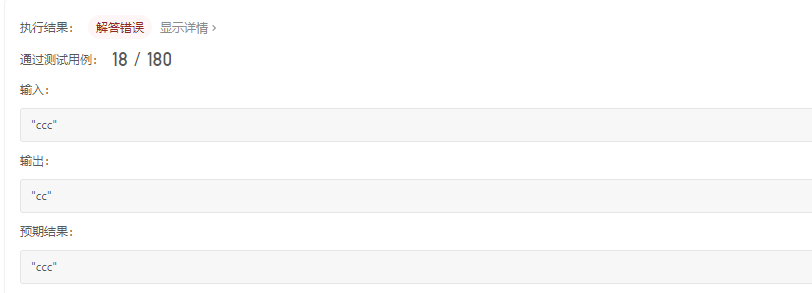
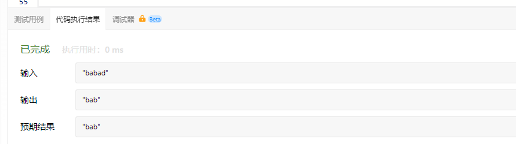

# 最长回文子串

给你一个字符串s，找到s中最长的回文子串。

示例1：
```
输入： s = "babad"
输出： "bab"
解释： "aba"同样是符合题意的答案
```

示例2：

```
输入： s = "cbbd"
输出： "bb"
```

提示：

- 1 <= s.length <= 1000
- s仅由数字和英文字母组成

# 我的代码

```
class Solution {
public:
    string longestPalindrome(string s) {
        string result;
        string temp;
        if(s.length()>0)
        {
            result+=s[0];
        }
        for(int i = 0;i<s.length();i++)
        {
            if(s.length()==1)
            {
                return s;
            }
            else if(temp.length()>0 && temp.find(s[i]) != string::npos)  // 找到了相同字符
            {
                result = "";
                for(int j = temp.find(s[i]);j<temp.length();j++)
                {
                    result += temp[j];
                }
                result += s[i];
                break;
            }
            else
            {
                temp += s[i];
            }
        }
        return result;
    }
};
```

代码执行结果：


执行结果：



基础不牢，地动山摇。哎...

# 方法一：动态规划

对于一个子串而言，如果它是回文串，并且长度大于2，那么将它首尾的两个字母去除之后，它仍然是个回文串。例如对于字符串“ababa”，如果我们已经知道"bab"是回文串，那么"ababa"一定是回文串，这是因为它的首尾两个字母都是“a”。

根据这样的思路，就可以用动态规划的方法解决本题。用P(i,j)表示字符串s的第i到j个字母组成的串是否为回文串：

- P(i，j) = true，如果子串Si...Sj是回文串
- P(i,j) = false，其他情况

其他情况包含两种可能性：

- s[i,j]本身不是一个回文串；
- i > j，此时s[i,j]本身不合法。

那么就可以写出动态规划的状态转移方程：

P(i,j) = P(i+1,j-1)^(Si==Sj)

也就是说，只有s[i+1,j-1]是回文串，并且s的第i和j个字母相同时，s[i,j]才是回文串。

上文的所有讨论是建立在子串长度大于2的前提之上的，还需要考虑动态规划中的边界条件，即子串的长度为1或2.对于长度为1的子串，它显然是个回文串；对于长度为2的子串，只要他的两个字母相同，它就是一个回文串。因此可以写出动态规划的边界条件：

- P(i，j) = true;
- P（i，i+1） = （Si == Si+1）

根据这个思路，就可以完成动态规划了，最终的答案即为所有P(i,j) = true中j-i+1的最大值。

注意：在状态转移方程中，是从长度较短的字符串向长度较长的字符串进行转移的，因此一定要注意动态规划的循环顺序。

```
#include <iostream>
#include <string>
#include <vector>

using namespace std;

class Solution {
public:
    string longestPalindrome(string s) {
        int n = s.size();
        if (n < 2) {
            return s;
        }

        int maxLen = 1;
        int begin = 0;
        // dp[i][j] 表示 s[i..j] 是否是回文串
        vector<vector<int>> dp(n, vector<int>(n));
        // 初始化：所有长度为 1 的子串都是回文串
        for (int i = 0; i < n; i++) {
            dp[i][i] = true;
        }
        // 递推开始
        // 先枚举子串长度
        for (int L = 2; L <= n; L++) {
            // 枚举左边界，左边界的上限设置可以宽松一些
            for (int i = 0; i < n; i++) {
                // 由 L 和 i 可以确定右边界，即 j - i + 1 = L 得
                int j = L + i - 1;
                // 如果右边界越界，就可以退出当前循环
                if (j >= n) {
                    break;
                }

                if (s[i] != s[j]) {
                    dp[i][j] = false;
                } else {
                    if (j - i < 3) {
                        dp[i][j] = true;
                    } else {
                        dp[i][j] = dp[i + 1][j - 1];
                    }
                }

                // 只要 dp[i][L] == true 成立，就表示子串 s[i..L] 是回文，此时记录回文长度和起始位置
                if (dp[i][j] && j - i + 1 > maxLen) {
                    maxLen = j - i + 1;
                    begin = i;
                }
            }
        }
        return s.substr(begin, maxLen);
    }
};

```

代码执行结果：



执行结果：


### 复杂度分析

- 时间复杂度：O(n^2)，其中n是字符串的长度。动态规划的状态总数为O(n^2)，对于每个状态，需要转换的时间为O(1)。
- 空间复杂度：O(n^2)，即存储动态规划状态需要的空间。
