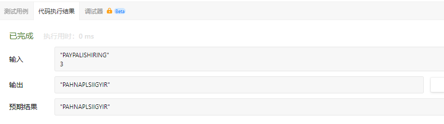

# Z字形变换

将一个给定字符串s根据给定的行数numRows，以从上到下、从左到右进行Z字形排序。

比如输入字符串为“PAYPALISHIRING”行数为3时，排列如下：

```
P   A   H   N
A P L S I I G
Y   I   R
```
之后，你的输出需要从左往右逐行读取，产生出一个新的字符串，比如："PAHNAPLSIIGYIR"。

请你实现这个将字符串进行指定行数变换的函数：

```
string convert(string s,int numRows);
```

示例1：

```
输入：s = "PAYPALISHIRING", numRows = 3
输出："PAHNAPLSIIGYIR"
```

示例2：

```
输入：s = "PAYPALISHIRING", numRows = 4
输出："PINALSIGYAHRPI"
解释：
P     I    N
A   L S  I G
Y A   H R
P     I
```

示例3：

```
输入：s = "A", numRows = 1
输出："A"
```

提示：

- 1 <= s.length <= 1000
- s由英文字母（小写和大写）、','和'.'组成
- 1 <= numRows <= 1000

#  我的代码

我在草稿纸上标出了s的重新排列的下标，找出了周期为2n-2，但是具体实现还是没有弄出来。

# 直接构造方法

我们来研究一下每个非空字符会对应到s的哪个下标（记作idx），从而直接构造出答案。由于Z字形变换的周期为 t = 2r-2，因此对于矩阵第一行的非空字符，其对应的idx均为t的倍数，即idx = 0(mod t)；同理，对于矩阵最后一行的非空字符，应满足idx = r-1（mod t）。

对于矩阵的其余行（行号设为i），每个周期内有两个字符，第一个字符满足idx = i（mod t），第二个字符满足idx = t-i（mod t）。

```
class Solution {
public:
    string convert(string s, int numRows) {
        int n =s.length();
        if(numRows ==1 || numRows >= n){
            return s;
        }
        int t = 2 * numRows - 2;
        string result;
        for(int i = 0;i < numRows;i++)
        {
            for(int j = 0;j+i<n;j+=t)
            {
                result += s[i+j];
                if(i > 0 && i < numRows-1 && j+t-i < n)
                {
                    result += s[j+t-i ];
                }
            }
        }
        return result;
    }
};
```

代码执行结果：



执行结果：


### 复杂度分析

- 时间复杂度：O（n），其中n为字符串s的长度。s中的每个字符仅会被访问一次，因此时间复杂度为O(n)。
- 空间复杂度：O（1）。返回值不计入空间复杂度。
