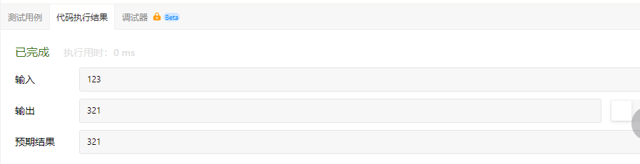
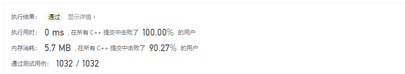

# 整数反转

给你一个32位的有符号整数x，返回将x中的数字部分反转后的结果。

如果反转后整数超过32位的有符号整数的范围[-2^31,2^32 - 1]，就返回0。

假设环境不允许存储64位整数（有符号或无符号）。

示例1：

```
输入： x = 123
输出： 321
```

示例2：

```
输入： x = -123
输出： -321
```

示例3：

```
输入： x = 120
输出： 21
```

示例4：

```
输入： x = 0
输出： 0
```

提示：

- -2^31 <= x <= 2^31 - 1

# 我的代码

我的思路是，将int转为string字符串，然后将string反转后，再将string转为int类型。

先不说自己的算法有多傻，就单说自己的知识有多匮乏吧。

# 数学方法

记rev为翻转后的数字，为完成翻转，可以重复弹出x的末尾数字，将其推入rev的末尾，直至x为0。

要在没有辅助栈或数组的帮助下弹出和推入数字，可以使用数学方法：

```
// 弹出x的末尾数字digit
digit = x % 10
x /= 10

// 将数字digit推入rev末尾
rev = rev * 10 + digit
```

算法代码：

```
class Solution {
public:
    int reverse(int x) {
        int result = 0;
        while(x!=0)
        {
            if(result < INT_MIN/10 || result > INT_MAX/10)
            {
                return 0;
            }
            int digit = x % 10;
            x /= 10;
            result = result * 10 + digit;
        }
        return result;
    }
};
```

代码执行结果：



执行结果：



### 复杂度分析

- 时间复杂度： O(log|x|)。翻转的次数即x十进制的位数。
- 空间复杂度： O(1)。
